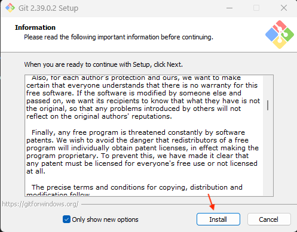

# İçindekiler

* [Başlarken](#başlarken)
* [Kurulum](#kurulum)
  * [MacOS X Kurulum](#macos-x-kurulum)
  * [Windows Kurulum](#windows-kurulum)
* [C ile AVR Programlama](#c-ile-avr-programlama)
  * [Register](#register)
  * [Port Registerleri](#port-registerleri)
    * [MCUCR (MCU Control Register)](#mcucr-mcu-control-register)
      * [PUD (Pull Up Disable)](#pud-pull-up-disable)
    * [DDRx (The Port x Data Direction Register)](#ddrx-the-port-x-data-direction-register)
    * [PORTx (The Port x Data Register)](#portx-the-port-x-data-register)
    * [PINx (The Port x Input Pins Address)](#pinx-the-port-x-input-pins-address)
  * [Temel Giriş Çıkış İşlemleri](#temel-giriş-çıkış-i̇şlemleri)

# Başlarken

Bu bölümde C programlama dili ile AVR mikrokontrolcü programlama hakkındaki notlarım bulunmaktadır. Burada prototipleme için ATmega328p çipine sahip Arduino UNO veya ATmega328pb çipine sahip Arduino Nano kullanılmıştır.

# Kurulum

Aşağıdaki bölümlerde MacOS X ve Windows için kurulumlar aşamalarıyla anlatılacaktır.

## MacOS X Kurulum

MacOS'ta kurulum yapabilmek için bir paket yöneticisi olan **Homebrew**'e ihtiyacımız var. Homebrew sisteminizde yüklü değilse önce Homebrew'i yüklemeniz gerekir. Ayrıca Homebrew, Xcode komut satırı araçlarının yüklenmesini de gerektirir. Bunun için öncelikle terminalimizi açıyoruz. Ardından sırasıyla ve tek tek olmak üzere aşağıdaki satırları terminalimize yazıyoruz:

### Paket yöneticisi Homebrew'in indirilmesi

> Bu komut Xcode komut satırı araçlarını indirir:

`xcode-select --install`

> Bu komut bir paket yöneticisi olan Homebrew'i indirir:

`/bin/bash -c "$(curl -fsSL https://raw.githubusercontent.com/Homebrew/install/HEAD/install.sh)"`

> Bu komut Homebrew güncellemeleri alır:

`brew update`

### Gerekli araçların indirilmesi

`brew tap osx-cross/awr`

> Bu komut paketleri güncellemeden önce düzgün kurulum için siler, eğer sisteminizde hiç kurulmamışsa `No such keg` hatası alırsınız, bunun için endişelenmenize gerek yok, sonraki komuta devam edebilirsiniz:

`brew remove avr-gcc avr-binutils avr-libc`

> Bu komut avr-gcc'yi indirir:

`brew install avr-gcc avr-binutils`

> Bu komut ISS kullanarak AVR mikroişlemcilerinin ROM ve EEPROM içeriğini işlemek için bir açık kaynak aracı olan AvrDude'u indirir:

`brew install avrdude`

> Bu komut bir programın yürütülebilir dosyalarının ve diğer kaynak olmayan dosyalarının, programın kaynak dosyalarından üretilmesini kontrol eden bir araç olan GNU Make'i indirir:

`brew install make`

> Bu komut git'i indirir:

`brew install git`

### Kontrol

Aşağıdaki komutlar ile indirdiğimiz araçların doğru şekilde kurulup kurulmadığını kontrol edebilirsiniz:

`avr-gcc --version`

`make --version`

`git --version`

`avrdude`

> Terminal çıktınız yaklaşık bu şekilde olmalıdır:


### Port numarasının bulunması

Derlenen kodların, avrdude aracılığıyla mikrokontrolcüye doğru bir şekilde iletilebilmesi için öncelikle kartımızı bağladığımız usb portunu öğrenmemiz gerekiyor. Bunu yapabilmek için Arduino IDE'yi **[indirip](https://www.arduino.cc/en/software)** kurmanız gerekiyor. Arduino ideyi kurduktan sonra, aşağıdaki adımları takip edin:

1. Arduino IDE'de yüklü gelen örnek kodlardan bir tanesini açın:

    

2. Arduino'yu usb konnektörü ile bilgisayarınıza bağlayın.

3. Arduino'yu bağladığınız portu ide üzerinden seçin.

    

4. Ardunio IDE'nin tercihler menüsünü açın.

    ]

5. Tercihler menüsünde "Yükleme sırasında ayrıntılı çıktı göster" seçeneğini aktif edin ve tercihler menüsünü kaydederek kapatın.

    

6. Kodu derleyin ve kartınıza yükleyin.

    

7. Ardından output kısmını genişletin ve çıktının en üzerinde belirtilen yerdeki port adınızı kopyalayıp not defterinize kaydedin.

    

8. Artık Arduino IDE'yi kapatabilirsiniz.

### Test Kodunun Çalıştırılması

1. Herhangi bir editör aracılığıyla aşağıdaki kodu main.c isimli bir dosyaya kaydedin.

    ```c
        #include <avr/io.h>
        #include <util/delay.h>
         
        #define BLINK_DELAY_MS 1000
         
        int main (void)
        {
            /* set pin 5 of PORTB for output*/
            DDRB |= _BV(DDB5);
         
            while(1) 
            {
                /* set pin 5 high to turn led on */
                PORTB |= _BV(PORTB5);
                _delay_ms(BLINK_DELAY_MS);
         
                /* set pin 5 low to turn led off */
                PORTB &= ~_BV(PORTB5);
                _delay_ms(BLINK_DELAY_MS);
            }
        }
    ```

2. Terminalden dosyayı oluşturduğunuz klasöre `cd klasör_ismi` komutuyla girin.

3. Ardından derleme işlemlerini yapmanız gerekiyor. Sırasıyla aşağıdaki komutları girin:

    `avr-gcc -Os -DF_CPU=16000000UL -mmcu=atmega328p -c -o main.o main.c`
    `avr-gcc -mmcu=atmega328p main.o -o main`
    `avr-objcopy -O ihex -R .eeprom main main.hex`

4. Not defterine kaydettiğiniz port adınızı aşağıdaki komutta **port_name** ile belirtilen kısma yazın ve komutu çalıştırın.

    `avrdude -F -V -c arduino -p ATMEGA328P -P  /dev/port_name -b 115200 -U flash:w:main.hex`

5. Test kodu, arduinonuz üzerindeki dahili ledi 1 saniye aralıklarla yanıp söndürmek içindir. Başarı ile çalışıyorsa, artık test kodu çalıştırma adımlarını tekrarlayarak c kodlarınızı arduino üzerinde çalıştırabilirsiniz.

## Windows Kurulum

Sırasıyla aşağıdaki işlemler takip edilmelidir.

### Git Kurulumu

1. Öncelikle bilgisayarınıza uygun **[git kurulum dosyasını](https://git-scm.com/download/win)** indirin.

    

2. Dosyayı indirdiğiniz konuma gidin ve dosyayı başlatın.

3. Dosya başlatıldığında özel izni kabul edin ve devam edin.

4. Install'a basarak devam edin.

    

5. Kurulumun bitmesini bekleyin.

    

6. Finish'e basarak kurulumu tamamlayın.

    

7. Git'i **[Ortam Değişkenlerine ekleyin.](#ortam-değişkenlerine-ekleme)**

#### avr-gcc'nin Kurulumu

1. Zip dosyasını **[indirin.](https://git-scm.com/download/win)**

2. Zip dosyasını kaydedeceğiniz konuma ayıklayın.

    

3. avr-gcc'yi **[Ortam Değişkenlerine ekleyin.](/#ortam-değişkenlerine-ekleme)**

### Ortam Değişkenlerine Ekleme

1. Windows Arama Menüsü'ne Ortam Değişkenleri yazarak "Sistem Ortam Değişkenlerini Düzenleyin" seçeneğine tıklayın.

    

2. Sistem Özellikleri Menüsünde bulunan "Ortam Değişkenleri..." butonuna tıklayın.

    

3. Ortam Değişkenleri menüsünün kullanıcı değişkenleri kısmından "Path"i seçerek "Düzenle..." butonuna tıklayın.

    

4. Öncelikle "Yeni" butonuna tıklayarak yeni bir satır oluşturun, ardından ortam değişkenlerine eklemek istediğiniz programın "bin" klasörünün yolunu kopyalayıp bu satıra yapıştırın ve "Tamam" butonuna basarak yaptıklarınızı kaydedin.

    

5. Tekrar "Tamam" butonlarına basarak Ortam Değişkenleri ve Sistem Özellikleri menülerini kapatın.

    |  |  |
|---|---|

### Kontrol

1. CMD'yi açın.

2. Sırasıyla

```
avr-gcc --version
make --version
git --version
avrdude
```

komutlarını çalıştırın. Terminal çıktınız aşağıdaki gibi gözükmelidir:

[](/images/teminal.png)

### Port numarasının bulunması

Derlenen kodların, avrdude aracılığıyla mikrokontrolcüye doğru bir şekilde iletilebilmesi için öncelikle kartımızı bağladığımız usb portunu öğrenmemiz gerekiyor. Bunu yapabilmek için Arduino IDE'yi **[indirip](https://www.arduino.cc/en/software)** kurmanız gerekiyor. Ardunio ideyi kurduktan sonra, aşağıdaki adımları takip edin:

1. Arduino IDE'yi açın.

2. Arduino Kartınızı bilgisayarınıza bağlayın.

3. Arduino IDE üzerinden "Tools" menüsünü açın ardından "Port" seçeneğinin üzerine gelin ve açılan yerden port adınızı not defterinize kaydedin.

[](/images/port.png)

4. Artık Arduino IDE'yi kapatabilirsiniz.

### Test Kodunun Çalıştırılması

1. Herhangi bir editör aracılığıyla aşağıdaki kodu main.c isimli bir dosyaya kaydedin.

```c
#include <avr/io.h>
#include <util/delay.h>
 
#define BLINK_DELAY_MS 1000
 
int main (void)
{
 /* set pin 5 of PORTB for output*/
 DDRB |= _BV(DDB5);
 
 while(1) {
  /* set pin 5 high to turn led on */
  PORTB |= _BV(PORTB5);
  _delay_ms(BLINK_DELAY_MS);
 
  /* set pin 5 low to turn led off */
  PORTB &= ~_BV(PORTB5);
  _delay_ms(BLINK_DELAY_MS);
 }
}
```

2. Terminalden dosyayı oluşturduğunuz klasöre `cd klasör_ismi` komutuyla girin.

3. Ardından derleme işlemlerini yapmanız gerekiyor. Sırasıyla aşağıdaki komutları girin:

`avr-gcc -Os -DF_CPU=16000000UL -mmcu=atmega328p -c -o main.o main.c`

`avr-gcc -mmcu=atmega328p main.o -o main`

`avr-objcopy -O ihex -R .eeprom main main.hex`

4. Not defterine kaydettiğiniz port adınızı aşağıdaki komutta **port_name** ile belirtilen kısma yazın ve komutu çalıştırın.

`avrdude -F -V -c arduino -p ATMEGA328P -P port_name -b 115200 -U flash:w:main.hex`

5. Test kodu, Arduinonuz üzerindeki dahili ledi 1 saniye aralıklarla yanıp söndürmek içindir. Başarı ile çalışıyorsa, artık test kodu çalıştırma adımlarını tekrarlayarak c kodlarınızı Ardunio üzerinde çalıştırabilirsiniz.

# C ile AVR Programlama

Arduino UNO Pinout Diyagramı:

[](https://forum.arduino.cc/t/arduino-uno-pinout-diagram/142856)

## Register

* Register; 8 ile 64 bit arasında, 2'nin kuvvetleri biçiminde, veri tutabilen bir bellek öbeğidir. Her bite 1 veya 0 değeri atanır. Microcontroller'daki bir çok farklı yazmaçtaki her bitin değeri sistemin geri kalanına ne zaman, ne yapacağını söyler. Arduino üzerinde bulundan ATmega328p çipindeki registerlerin çoğu 8 ya da 16 bittir.

:warning: Registerlerin 1 ya da 0 değerini alması, gerçekte elektiğin var olup olmamasıdır. 1 değeri aynı zamanda HIGH ya da TRUE, 0 değeri aynı zamanda LOW ya da FALSE ile de ifade edilebilir.

* Programcı bitwise operatörler yardımıyla registerin 0-7 arası bitlerine müdahale eder ve böylelikle yürütülecek programı yönetir.

* ATmega328p mikrodenetleyicisinin data sheete yardımı ile, bu mikrodeneyleyicinin çevre birimlerini manipüle ederek programlama yapacağız. Burada I/O (Input/Output) ile alakalı üç ana register ve I/O ile ilişkili bir ayar biti bulunduran bir register ile başlayalım.

## Port Registerleri

### MCUCR (MCU Control Register)


ATmega328p Data Sheet, Sayfa 72

* Mikrodenetleyicinin denetimi ile ilgili 5 biti bulunur. Bu bitleri 0 ya da 1 yaparak ayarlamaları yaparız.

* Programlama yaparken bu registerin bitlerini değiştirmek istediğimizde, örneğin "PUD" isimli 4. bitini değiştirmek istediğimizde `MCUCR |= 0x10` ya da `MCUCR |= 0b00010000` şeklinde `MCUCR` adını kullanarak manipülasyon yaparız.

* Bu registerin bazı bitleri sadece okunabilirken bazıları hem okunabilir hem de yazılabilirdir. 0, 1 ve 4 numaralı bitler hem okunabilir hem de yazılabilirken 2, 3, 5, 6 ve 7. bitler read only yani sadece okunabilir bitlerdir.

#### PUD (Pull Up Disable)

* MCUCR'nin 4. biti PUD'dur.

* Bu bit 1 olduğunda tüm I/O portlarındaki internal [Pull-Up dirençleri](https://en.wikipedia.org/wiki/Pull-up_resistor) devre dışı kalır.

* Bu bit 1 olduğunda, başka registerlerde tanımlanan Pull-Up enable'ın bir anlamı olmaz.

### DDRx (The Port x Data Direction Register)

* Belirtilen x, pinout diyagramda görülebilen portların temsilidir. x yerine yazılacak port adı, program akışında, komponentlerin bağlandığı yerlere göre değişkenlik gösterir.

* Bu register, I/O portunun input için mi yoksa output için mi kullanılacağını belirler.

* Bu registerin bitlerini 1 yapmak, o bitin output olduğunu, 0 yapmak ise o bitin output olduğunu söyler. Örneğin B portunun 0. ayağına (Arduino kartının 8. pini) bir led bağladıysak burada bu ayağı output olarak işretlemeliyiz yani `DDRB |= 0b00000001`veya `DDRB |= 0x01` şeklinde bir tanımlama yapmalıyız.

### PORTx (The Port x Data Register)

* AVR mikrodenetleyicilerinde G/Ç yapılan bitler 8 bitlik port olarak bir araya toplanmıştır.

* Ayakların her birini yazılımsal olarak kontrol etmek mümkünse de ayakların her biri porttan bağımsız değildir.

* Ayakların 8'li gruplara ayrılmasının bir nedeni mikrodenetleyicinin 8 bit olmasıdır. Ancak en önemli nedeni tek ayaktan alınan giriş ve çıkışın tek başına bir şey ifade etmeyişidir.

* Portlar 0 ile 255 arasında değer alabilir ve bu değerlerin 2'lik sistemdeki karşılığını ayaklara yansıtabilir. Aynı zamanda bu 0 ve 255 arasında yani bayt büyüklüğünde değeri de porttan okuyabilir.

* Portların 8'li ayak grubu olması tek bir ayak üzerinden işlem yapılamayacağı anlamına gelmez. Ancak doğrudan değil dolaylı olarak bu işlemi gerçekleştiririz.

### PINx (The Port x Input Pins Address)

* Dijital giriş için kullanılan yazmaçtır.

* Ayaklardaki elektriksel durumu **okumayı** sağlar. Bir butonun açık veya kapalı oluşundan 8-bitlik bir paralel iletişim bağlantısını okumaya kadar bir çok örnek bu duruma verilebilir.

* DDRx ile giriş olarak tanımlanan portlardan/pinlerden dığrudan port veya pin okuma yöntemi ile registerden elde edilen değer sonrasında mikrodenetleyicinin hafıza birimlerine kaydedilir ve bu değer üzerinde işlem yapılarak çıkış birimlerine iletilir. Burada verinin okunduktan sorna nasıl kaydedileceği, işleneceği ve çıkış olarak verileceği programcının yazdığı programa bağlıdır.

## Temel Giriş Çıkış İşlemleri

* Portların ayakları Input, Input Pull-Up, Sink, Source ve Tri-State konumlarında olabilir.

  * Input: Input konumda harici olarak pull up veya pull down dirençleri ile beslemeye ya da şaseye bağlıdır.

  * Input Pull-Up: Input konumda, dahili pull-up direncine bağlıdır.

  * Sink: Output konumunda 0/LOW/FALSE durumudur. 0V, 20mA akım **çeker**. Bu yüzden sink(akmak) olarak adlandırılır.

  * Source: Output konumunda 1/HIGH/TRUE durumudur. 5V, 20mA civarında akım **verir**.

  * Tri-state: Ne mantıksal HIGH ne de mantıksal LOW demektir. Hükmü olmayan bir durumu temsil eder.

# Kaynaklar

1. <https://ww1.microchip.com/downloads/en/DeviceDoc/Atmel-7810-Automotive-Microcontrollers-ATmega328P_Datasheet.pdf>

2. <https://www.lojikprob.com/avr/c-ile-avr-programlama-60-butun-derslerin-listesi/>

3. <https://www.instructables.com/Microcontroller-Register-Manipulation/>
